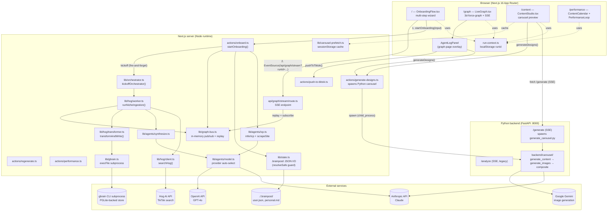
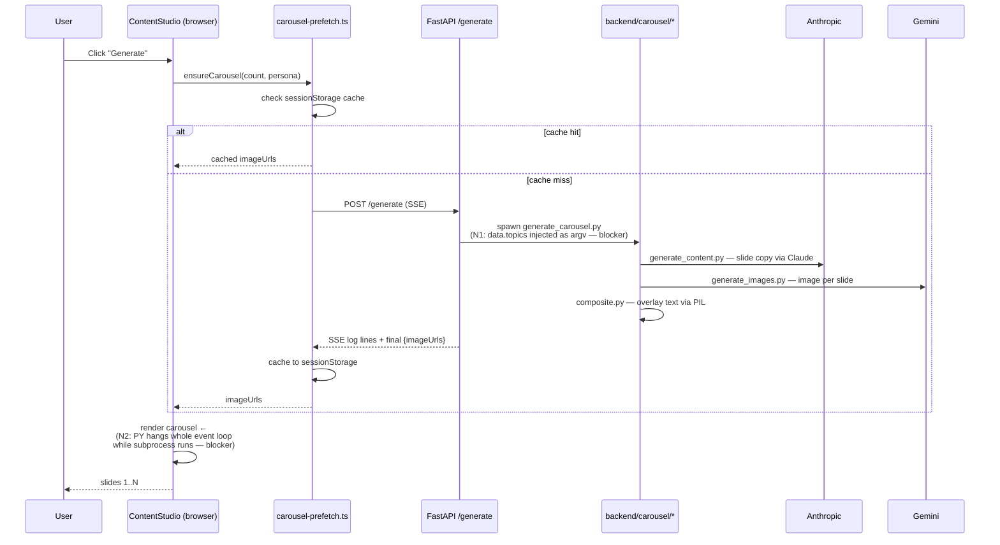
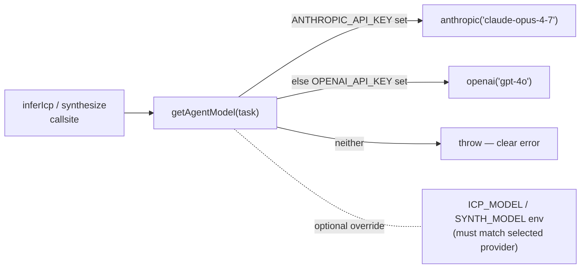

# Architecture

End-to-end view of how the app fits together. Diagrams render natively on GitHub.

## 1. System overview



## 2. Onboarding flow (the hot path)

```mermaid
sequenceDiagram
  participant U as User
  participant OB as OnboardingFlow (browser)
  participant SA as startOnboarding (server action)
  participant ICP as inferIcp / scrapeSite
  participant ORCH as orchestrator
  participant W as runNicheIngestion (×N)
  participant BUS as graphBus
  participant SSE as /api/graph/stream
  participant GB as gbrain CLI

  U->>OB: Fill website / description / tiktok
  U->>OB: Click "Analyze"
  OB->>SA: startOnboarding({website, description, tiktok})
  activate SA
  SA->>BUS: publish "Initializing", "Target: ..."
  SA-->>OB: { runId }   (returns immediately)
  deactivate SA

  par client subscribes
    OB->>SSE: open EventSource(?runId=...)
    SSE->>BUS: replay(runId)
    SSE-->>OB: stream backlog
    SSE->>BUS: subscribe(runId)
  and server pipeline (fire-and-forget)
    SA->>ICP: scrapeSite(url) — SSRF-guarded
    SA->>ICP: inferIcp(...)  — Claude OR OpenAI via model.ts
    SA->>BUS: publish ICP + niches log lines
    SA->>ORCH: kickoffOrchestrator({runId, niches})
    loop for each niche (parallel)
      ORCH->>W: runNicheIngestion(niche)
      W->>BUS: publish "Searching Hog..."
      W->>W: searchHog(query)
      W->>W: synthesizeStrategyFromCaptions(...)
      W->>BUS: publish nodes/edges + nicheReady
      W->>GB: transformAndWrite (awaited; data-loss bug fixed)
      W->>BUS: publish "GBrain pages written"
    end
    ORCH->>BUS: publish allReady
  end

  loop SSE -> client
    BUS-->>SSE: forward each event
    SSE-->>OB: data: {kind, ...}\n\n
    OB->>OB: drainTypeQueue + setLogLines / setLiveGraph
  end

  Note over BUS: 60s after allReady,<br/>orchestrator cleanup<br/>drops inflight + buffer<br/>+ writtenSlugs (B1/B2/F1)

  U->>OB: Click "View live graph"
  OB->>OB: router.push(/graph?runId=...)
```

## 3. Carousel generation flow



## 4. Data stores & lifetimes

| Store | Location | Lifetime | Notes |
|---|---|---|---|
| **graphBus.buffers** | Node process memory | 60s after allReady | per-runId event log for SSE replay |
| **inflight orchestrator** | Node process memory | 60s after settle | dedup against double-kicks |
| **writtenSlugsByRun** | Node process memory | 60s after settle | first-write-wins dedup for GBrain pages across a run |
| **runId** | `window.localStorage` | indefinite | ⚠ E1: leaks across tabs/users on shared browsers |
| **user.json + personal.md** | `./.brainpost/` (disk) | indefinite | onboarding result snapshot |
| **GBrain pages** | gbrain PGLite (subprocess-owned) | indefinite | niches/, creators/, hooks/, patterns/ |
| **carousel cache** | `window.sessionStorage` | tab lifetime | keyed by slide count |
| **carousel images** | `backend/carousel/output/` → mounted at `/slides/*` | until next `/generate` (rmtree) | |

## 5. Provider selection (model.ts)



## 6. Key cross-cutting concerns

- **Auth**: none. Every server action and the SSE route are public POST/GET. Single-tenant by convention.
- **SSRF**: `scrapeSite` validates scheme + denies loopback / RFC1918 / link-local / CGNAT + re-validates on every redirect hop (manual redirect mode).
- **Path traversal**: `state.ts` writes/reads only via `resolveSafe(rel)` which fails on any path that escapes `BASE`.
- **Provider neutrality**: agents go through `getAgentModel`; the same code runs against Claude or OpenAI depending on `.env`.
- **In-flight cancellation**: not implemented. Closing the browser tab does not abort the Claude/Hog calls already running on the server (deferred: J1).

See [CHANGELOG.md](CHANGELOG.md) for the running engineering log and outstanding deferred items.
